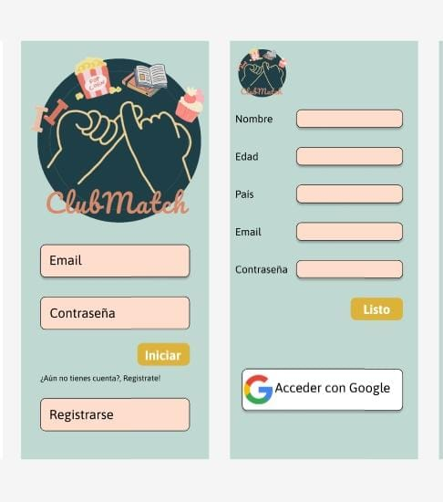
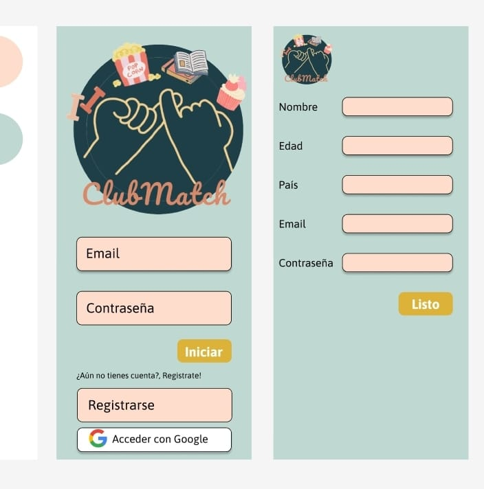
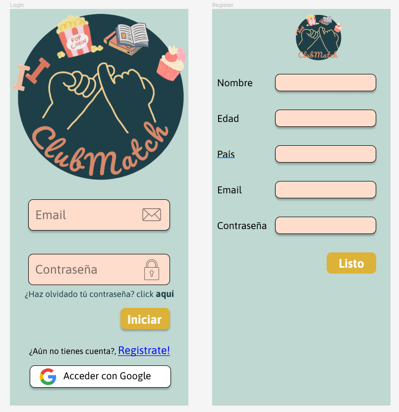
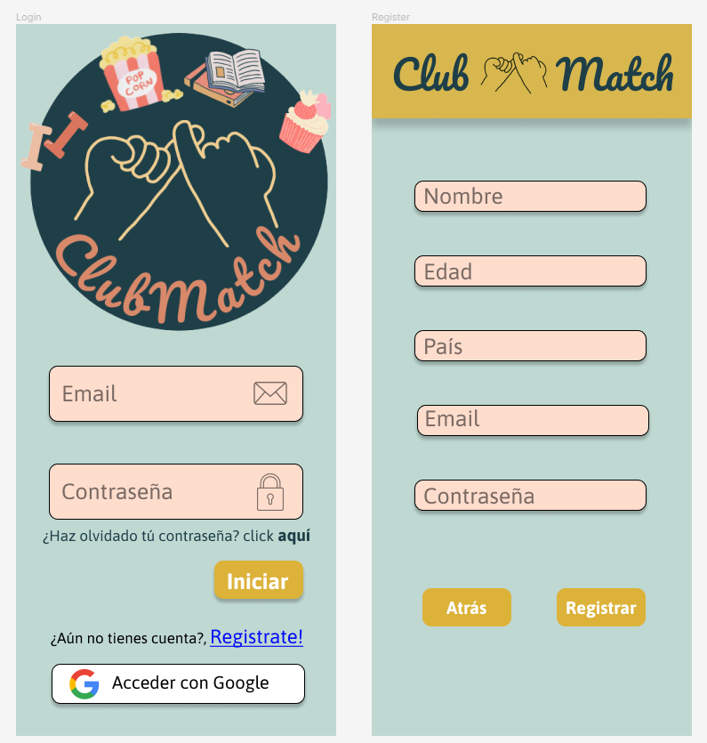
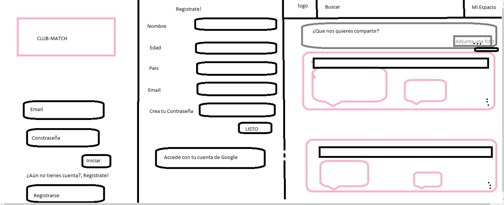
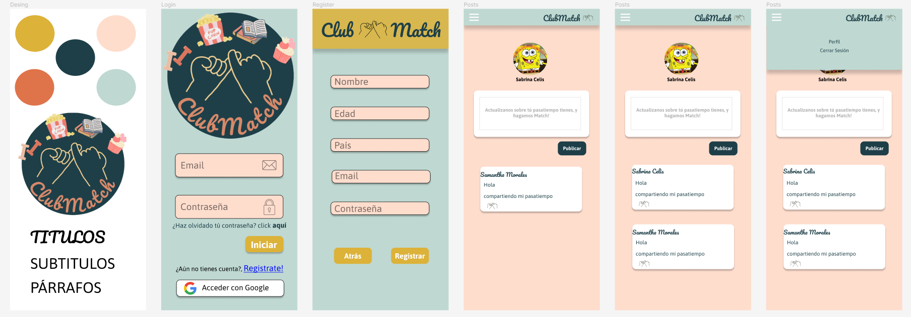
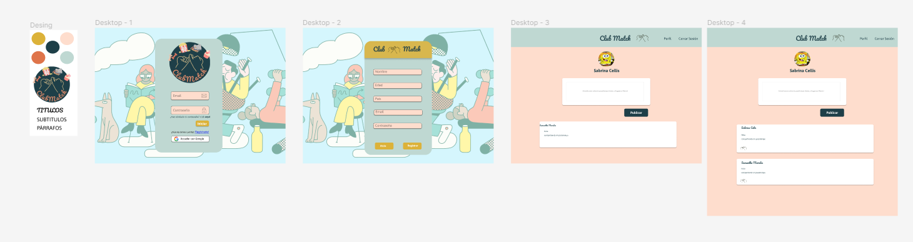

# Club Match
Hey, te gusta salir o hacer alguna actividad  y no tienes con quien?
Bienvenidx  a   ** Club Match** , ¡Regístrate ! 
 Aquí encontraras amigos o solo personas con quienes  compartir  el mismo pasatiempo, crear clubes y tener un espacio para conversar.
- Link proyecto: [Ir al Sitio](https://)

# Historias de Usuario

## Investigación de Usuario
Se realizo una encuesta para descubrir  las necesidades de los usuarios a la hora de ingresar a una nueva Red Social y como les gustaría compartir sus pasatiempos.

## 1° Historia de Usuario - " Yo como nuevo usuario me gustaría poder loguear con Google."

|  CRITERIOS DE ACEPTACIÓN   |     TERMINADO  |
|--|--|
| 1- En la vista existe la opción para loguearse con Google mediante un botón. |1-Crear Botón | 
   |  |2- Al hacer click en el botón abre una ventana emergente que permite elegir su correo 

## 2° Historia de Usuario - " Yo como nuevo usuario me gustaría poder registrarme en la página."

|  CRITERIOS DE ACEPTACIÓN   |     TERMINADO  |
|--|--|
| 1- Existe un formulario donde el usuario puede ingresar su información para registro. |1-Crear Formulario con inputs.   | 
   | 2-Existe un botón "Iniciar", y al hacer  click en él se guarda la información entregada por el usuario  |2- Al hacer click en el botón se guarda la información en variables que se almacenan en la base de datos de Firebase.
   
## 3° Historia de Usuario - " Yo como  usuario me gustaría poder compartir mis pasatiempos a través de estados ."

| CRITERIOS DE ACEPTACIÓN                                                                                  | TERMINADO                                                                                                       |
|----------------------------------------------------------------------------------------------------------|------------------------------------------------------------------------------------------------------------------|
| 1- Existe un campo para el usuario en donde puede actualizar sus pasatiempos.                            | 1-Crear input que recibe y almacena la información del nuevo post.                                               |
| 2-Se crea un botón "Publicar", y al hacer  click en él se guarda la información entregada por el usuario. | 2-Al hacer click en el botón se guarda la información en variables que se almacenan en la Colección de Firebase. |
| 3- En el momento que se guarda la información se visualiza el post.                                      | 3-Existe un observador que actualiza el muro cuando se hace un nuevo post.                                       |

## Testeo de Usabilidad
Durante el proyecto se realizaron testeos de usabilidad en la pagina de Login y Register, para saber si los botones y las vistas de cada página estaban diseñados de manera intuitiva para el usuario.

### Login(antes)
A traves de los testeo de usabilidad los usuarios pudieron ver las diferentes formas de ingresar a nuestra página y la ubicación de los botones. Uno de los feedbacks fue cambiar el botón para logear con google que estaba ubicado en la página de registro y fue reubicado a la página de inicio para que se tuviera un acceso más rapido a él. También cambiamos de color los inputs para una mayor visión de los textos. Sacamos también los textos descriptivos y dejamos solamente los "Placeholder" para un mejor uso del espacio en la página.

### Login(después)

### Register(antes)

### Register(después)

## Prototipo de baja fidelidad

## Prototipo de Alta fidelidad Mobile

## Prototipo de Alta fidelidad Desktop

## Resultado Final Página Mobile

## Resultado Final Página Web

# Consideraciones Finales 
En conclusion lo que buscamos en nuestra red social es dar un lugar a las personas para poder crear sus pequeñas sociedades en donde se puedan sentir acompañados por otros y puedan sentirse en un lugar amigable. Dando formas faciles y accesibles para poder acceder a ella y que toda la tematica, colores, etc, se vea reflejado en eso.